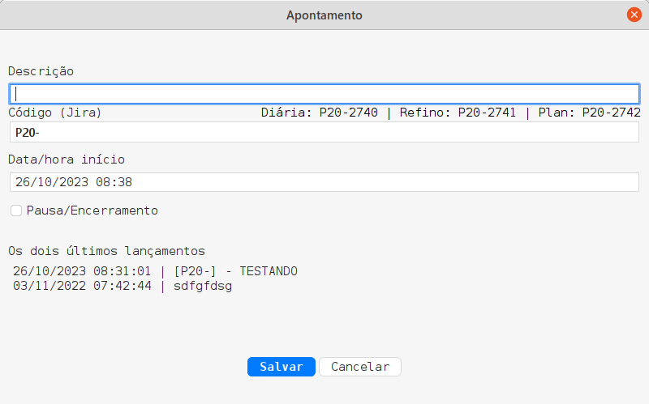

# 🕒 Meu Dia para TASK 🗂️

---

## 🎯 Objetivo

**O problema:**
Você começa uma atividade e depois luta para controlar o tempo gasto? Escreve seus horários em um bloco de notas e depois tem que transferir tudo para uma planilha?

**A solução:**
Apresentando "Meu Dia para TASK", a ferramenta que transforma a gestão do seu tempo em um processo super fluído!

Com uma proposta descomplicada, assim que iniciado, o programa discretamente repousa na sua barra de tarefas com um ícone de relógio. Ao clicar, simplesmente selecione "Apontar o que vou fazer" e voilà:



Registre sua atividade e clique em "Salvar".

Vai tirar uma pausa ou encerrar o dia? Temos um botão para isso: "Pausa/Encerramento".

---

## 🚀 Configuração

### ☕ Java
É fundamental ter o Java instalado para executar a ferramenta.
[**Baixe aqui**](https://www.java.com/pt-BR/download/manual.jsp)

### 🔧 Config.json
No coração do programa, temos o arquivo "config.json". Ele contém:

- **projectCode:** Código do seu projeto no TASK.
- **username:** Seu usuário no TASK.
- **teamCode:** Código da sua equipe no TASK.
- **defaultCode:** Padrão comum dos códigos de ferramentas.
- **tip:** Dica ao lado do campo 'Código (Jira)'. Ideal para listar códigos frequentemente usados.

---

## 📥 Download

Pronto para dar um boost na sua produtividade?
[**Baixe a última versão aqui**](https://github.com/luis-olivetti/meu-dia-para-task/releases)

---

## 🏭 Gerando .jar

Usando o Maven, execute o seguinte comando: 

```shell
mvn clean compile assembly:single
```
---

🌟 Dê adeus à gestão manual do seu tempo e deixe "Meu Dia para TASK" transformar seu dia a dia! 🌟

---